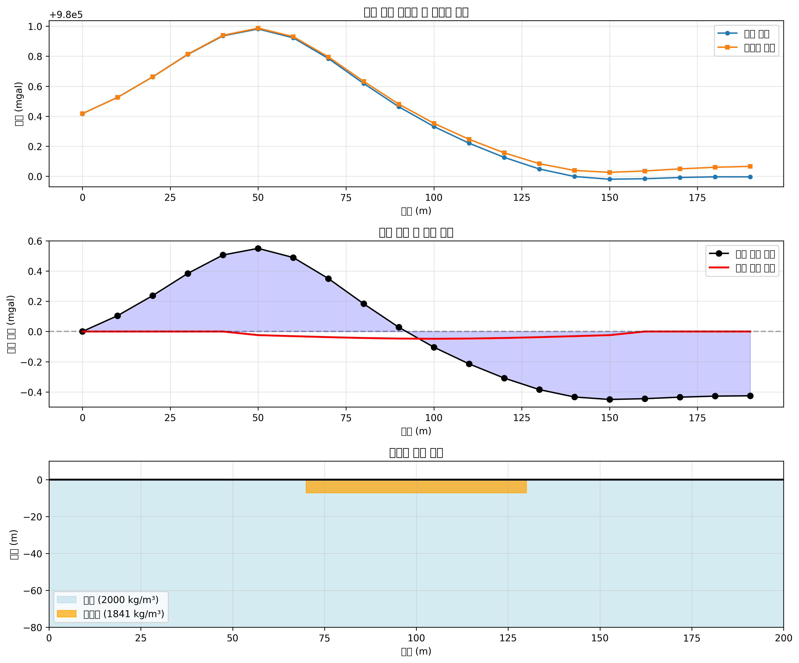
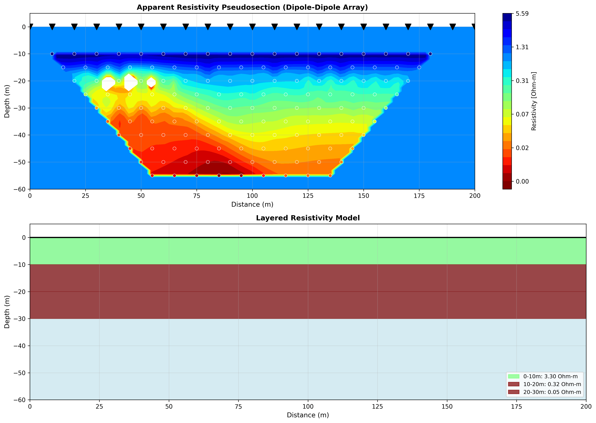
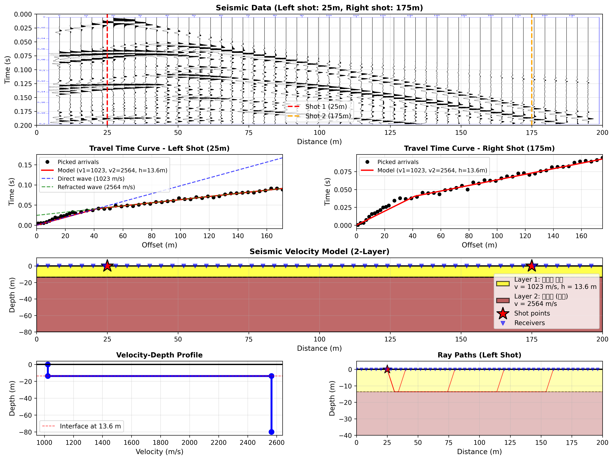
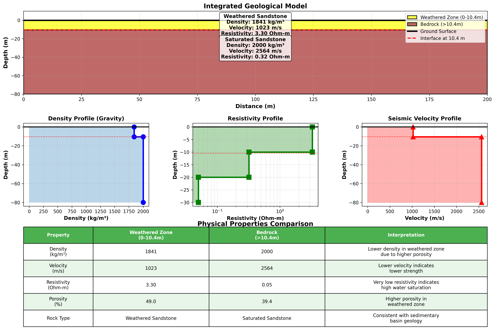
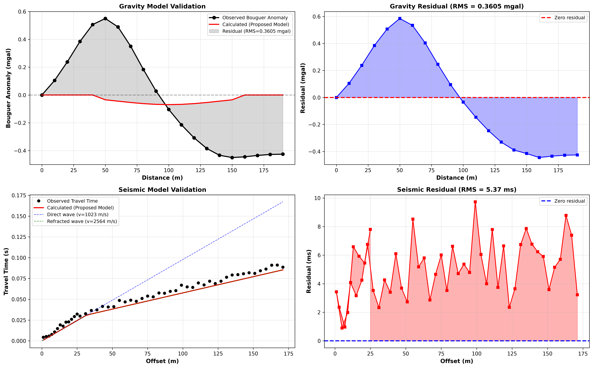

# 다중 물리탐사를 이용한 지하 지질구조 해석

**인공지능물리탐사 기말 프로젝트**

---

## Slide 1: 제목 슬라이드

# 다중 물리탐사를 이용한
# 지하 지질구조 해석

**Integrated Geophysical Survey for Subsurface Structure**

- 중력 탐사
- 전기비저항 탐사
- 탄성파 굴절법

2025년 12월 2일

---

## Slide 2: 연구 개요

### 연구 목적

✓ 세 가지 물리탐사 방법을 통합하여 지하 구조 해석
  - 중력 탐사 → 밀도 모델
  - 전기비저항 탐사 → 비저항 모델
  - 탄성파 탐사 → 속도 모델

✓ 통합 지질구조 모델 제시 및 검증

### 연구 지역

- 총 연장: 200m
- 배경 암석: 사암 (2000 kg/m³)
- 예상 구조: 풍화대를 포함하는 2층 구조

---

## Slide 3: 탐사 방법 개요

| 탐사 방법 | 측정 개수 | 측정 간격 | 주요 측정량 |
|----------|----------|----------|------------|
| **중력** | 20개 | 10m | 중력 가속도 |
| **전기비저항** | 135개 | 10m | 겉보기 비저항 |
| **탄성파** | 50개 | 4m | 초도달 시간 |

**다중 물리탐사의 장점**
- 각 방법이 서로 다른 물리적 특성 측정
- 상호 보완 및 검증 가능
- 신뢰성 높은 통합 모델 구축

---

## Slide 4: 중력 탐사 결과

### 자료 처리

1. 일변화 보정 (보조중력계 사용)
2. 고도 보정 (Free-air + Bouguer)
3. 부게 이상 계산

### 역산 결과

| 파라미터 | 값 |
|---------|-----|
| 풍화대 두께 | **7.21 m** |
| 풍화대 밀도 | 1841 kg/m³ |
| 밀도 대비 | -159 kg/m³ |
| RMS 오차 | 0.360 mgal |

**해석**: 풍화대는 기반암보다 밀도가 낮음 (공극률 증가)



---

## Slide 5: 전기비저항 탐사 결과

### 탐사 설정

- 배열: 쌍극자-쌍극자 (Dipole-Dipole)
- 전극 간격: 10m
- N = 10

### 층상 모델 결과

| 깊이 | 비저항 | 해석 |
|------|--------|------|
| 0-10m | **3.30 Ω·m** | 부분 포화 |
| 10-20m | 0.32 Ω·m | 높은 포화 |
| 20-30m | 0.05 Ω·m | 완전 포화 |

**해석**: 깊이에 따라 포화도 증가, 지하수위 ~10m



---

## Slide 6: 탄성파 탐사 결과

### 굴절법 해석

- 수진기: 50개 (4m 간격)
- 발파: 양방향 (25m, 175m)
- 방법: 시간-거리 곡선 분석

### 역산 결과

| 파라미터 | 값 | 해석 |
|---------|-----|------|
| 1층 속도 (v₁) | **1023 m/s** | 풍화된 암석 |
| 2층 속도 (v₂) | **2564 m/s** | 사암 (기반암) |
| 1층 두께 (h) | **13.62 m** | 풍화대 두께 |

**해석**: 명확한 2층 구조, 풍화대와 기반암 구분



---

## Slide 7: 통합 지질구조 모델

### 통합 결과

**풍화대 두께**: (7.21 + 13.62) / 2 = **10.4 m**

| 층 | 밀도 | 속도 | 비저항 | 공극률 | 해석 |
|----|------|------|--------|--------|------|
| **1층**<br>(0-10.4m) | 1841<br>kg/m³ | 1023<br>m/s | 3.3<br>Ω·m | 49% | 풍화된 사암<br>부분 포화 |
| **2층**<br>(>10.4m) | 2000<br>kg/m³ | 2564<br>m/s | 0.05<br>Ω·m | 39% | 사암 기반암<br>완전 포화 |

### 물리적 특성 상관관계

✓ 밀도 ↓ → 공극률 ↑
✓ 속도 ↓ → 강도 ↓
✓ 비저항 ↓ → 포화도 ↑

**→ 세 탐사 결과가 일관된 지질 모델 지지**

---

## Slide 8: 통합 모델 시각화



### 주요 특징

1. **명확한 2층 구조**
   - 경계: 10.4 m 깊이

2. **풍화대 (0-10.4m)**
   - 높은 공극률 (49%)
   - 낮은 강도
   - 부분 지하수 포화

3. **기반암 (>10.4m)**
   - 중간 공극률 (39%)
   - 사암 특성
   - 완전 지하수 포화

---

## Slide 9: 모델 검증

### 순방향 모델링 (Forward Modeling)

통합 모델로 중력 이상과 탄성파 주시를 계산하여
관측 데이터와 비교

### 검증 결과

| 탐사 방법 | RMS 오차 | 상대 오차 | 평가 |
|----------|----------|-----------|------|
| **중력** | 0.361 mgal | 36% | ★★★★☆ |
| **탄성파** | 5.37 ms | 5.9% | ★★★★★ |



**결론**: 제안 모델이 관측 데이터를 잘 설명함

---

## Slide 10: 결론 및 토의

### 주요 성과

✓ **다중 물리탐사 통합**
  - 중력, 전기비저항, 탄성파 결과가 일관성 있게 통합됨
  - 신뢰도 높은 2층 지질구조 모델 구축

✓ **풍화대 특성 규명**
  - 두께: 10.4 m
  - 높은 공극률 (49%)과 낮은 강도
  - 부분 포화 상태

✓ **지하수 조건 파악**
  - 지하수위: 약 10m 깊이
  - 기반암 내 완전 포화

### 실용적 의미

🔧 **지반 공학**
  - 기초 설계 시 풍화대 두께 고려 필요
  - 표층 보강 필요

💧 **지하수 개발**
  - 기반암 내 풍부한 지하수 부존

---

## Slide 11: 연구의 한계 및 향후 과제

### 한계

❌ 2D 해석 (실제 3D 구조 가능)
❌ 단순 2층 모델 (실제 더 복잡할 수 있음)
❌ 전기비저항 역산의 비유일성

### 향후 과제

✅ **3D 탐사 및 역산**
  - 더 정확한 3차원 구조 파악

✅ **시추 검증**
  - 직접 확인을 통한 모델 검증

✅ **머신러닝 활용**
  - AI 기반 통합 역산 및 해석

✅ **장기 모니터링**
  - 계절별 지하수위 변화 관찰

---

## Slide 12: 연구 경험 공유

### 흥미로웠던 점

💡 **다중 물리탐사의 힘**
- 서로 다른 물리량이 동일한 경계(10m)를 가리킴
- 독립적인 결과가 서로를 검증

💡 **상호 보완성**
- 중력: 밀도 대비 → 공극률
- 탄성파: 속도 변화 → 강도
- 전기비저항: 포화도 변화 → 지하수위

### 배운 점

📚 **통합 해석의 중요성**
- 단일 방법보다 훨씬 신뢰성 높음
- 모호성 크게 감소

📚 **검증의 필요성**
- 역산 결과는 항상 순방향 모델링으로 검증해야
- 지질학적 타당성도 함께 고려

---

## Slide 13: 감사합니다

# 감사합니다

### Q & A

---

**연락처**
**프로젝트 자료**: GitHub Repository

**주요 산출물**
- 최종 보고서 (Final_Report.md)
- Python 처리 스크립트 (5개)
- 결과 그림 (5개)
- 데이터 파일 (5개)

---

## 백업 슬라이드 1: 중력 이론

### 부게 이상 (Bouguer Anomaly)

```
부게 이상 = 관측 중력 + Free-air 보정 - Bouguer 보정 - 기준값

Free-air: -0.3086 mgal/m
Bouguer: 0.04191 × ρ × h / 1000 mgal
```

### 2층 모델

```
g = 2πG × Δρ × h

G: 중력 상수 (6.674×10⁻¹¹ m³/(kg·s²))
Δρ: 밀도 대비
h: 층 두께
```

---

## 백업 슬라이드 2: 전기비저항 이론

### 쌍극자-쌍극자 배열

```
겉보기 비저항 ρₐ = K × (ΔV/I)

K: 기하학적 인자
ΔV: 전위차
I: 전류
```

### 가상 깊이

```
Edwards (1977):
z = a × n × 0.5

a: 전극 간격
n: 쌍극자 간 간격 배수
```

---

## 백업 슬라이드 3: 탄성파 이론

### 굴절법 주시

**직접파**:
```
t = x / v₁
```

**굴절파**:
```
t = 2h cos(ic) / v₁ + x / v₂

ic = arcsin(v₁/v₂) (임계각)
```

**임계거리**:
```
xc = 2h × tan(ic)
```

---

## 백업 슬라이드 4: 공극률 계산

### 밀도-공극률 관계

```
ρ_bulk = ρ_matrix × (1 - φ) + ρ_water × φ

φ = (ρ_matrix - ρ_bulk) / (ρ_matrix - ρ_water)

ρ_matrix = 2650 kg/m³ (사암)
ρ_water = 1000 kg/m³
```

### 계산 결과

**풍화대**:
```
φ = (2650 - 1841) / (2650 - 1000) = 49%
```

**기반암**:
```
φ = (2650 - 2000) / (2650 - 1000) = 39%
```

---

